The Azure Environment Setup Guide

Welcome to the Disrupt AI Hackathon!

Team Number: \$1

Code: \$2

This guide will show you how to get your team access to your Azure credits for
the hackathon

-   Each team receives \$150 in Azure credits

-   **\*Only one**\* team member should complete the steps in this guide

-   All team members using Azure will require a Microsoft account

 

Step 1: Create a Microsoft account
----------------------------------

In order to use Azure you require a Microsoft account. Each team member who
wishes access to the Azure subscription will need a Microsoft account.

### What is a Microsoft Account?

A Microsoft account is an all-access pass to Microsoft's premier services,
helping you get things done, have more fun, and stay in touch. Your Microsoft
account lets you manage everything all in one place. Keep tabs on your
subscriptions and order history, organize your family's digital life, update
your privacy and security settings, track the health and safety of your devices,
and get rewards. Everything stays with you in the cloud and across devices,
including iOS and Android.

### Already have a Microsoft account?

If you have a \@outlook.com; \@live.com; \@hotmail.com; or \@msn.com account
these are already registered as Microsoft accounts and you can skip ahead to
[Step 2](#_Step_2:_Create) Create your team Azure subscription.

### Don’t have a Microsoft account?

You can each of your team members can create one by either creating a new
Microsoft account and email address or by associating your existing email (e.g.
\@gmail.com; \@yahoo.com) with a Microsoft account.

Follow the instructions on [How to create a new Microsoft
Account](https://support.microsoft.com/en-us/help/4026324/microsoft-account-how-to-create).

Step 2: Create your team Azure subscription
-------------------------------------------

Log in to Azure subscription portal

1.  Open a browser using InPrivate/Incognito mode.

2.  Navigate to <https://aka.ms/joinedu>

3.  Sign in using your Microsoft account

4.  Select **Next**

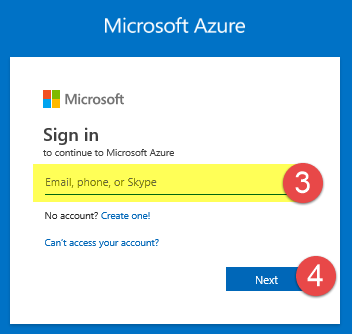

Activate your Azure team subscription

1.  On the Join course page, enter your assigned conference code ( \$2) to
    activate your team Azure subscription

2.  Select **Join**

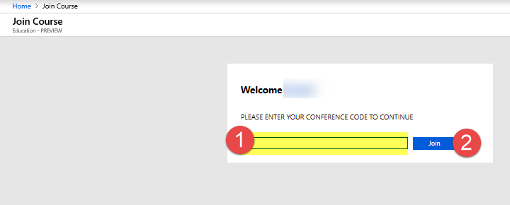

If this is your first Azure subscription – you will be prompted to agree to
terms and conditions. You must accept the subscription agreement, offer details,
and privacy statement to create your subscription.

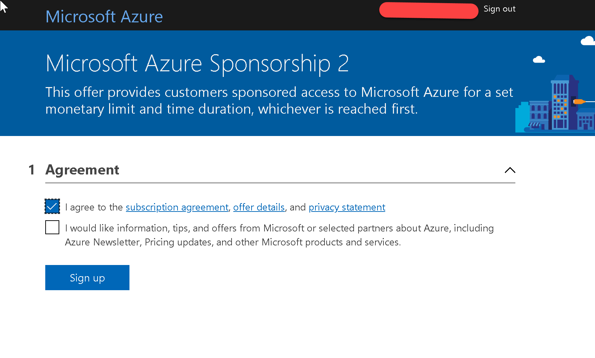

1.  On the Education Quick start page select **Setup Lab**

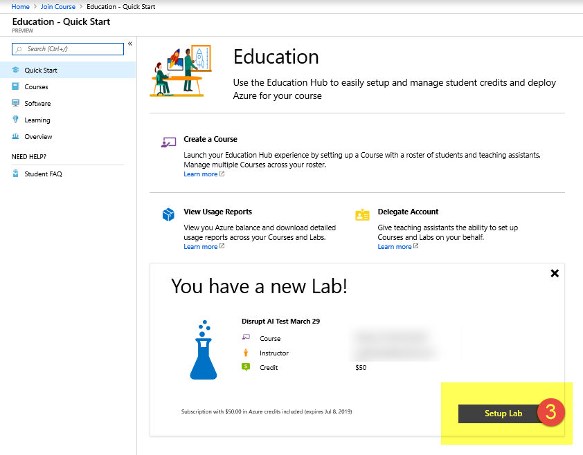

You will see a *Lab setup is in progress* message as your subscription is set
up. It may take a few minutes for this step to complete.

1.  When this message changes to Lab setup completed successfully select **Go to
    lab**

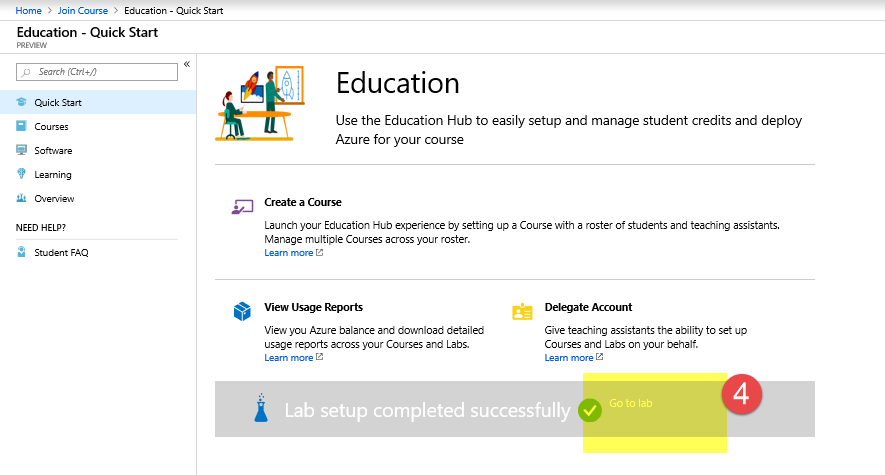

Verify your subscription has been created.

On the lab page you should see

1.  Subscription name and key

2.  Status: Active

3.  Credit status

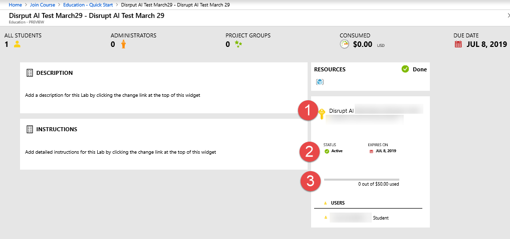

Step 3: Add your team members/users to the team subscription: 
--------------------------------------------------------------

1.  At the top of the Azure portal type “*subscription*” in the search bar.

2.  Select **Subscriptions** from the search results.

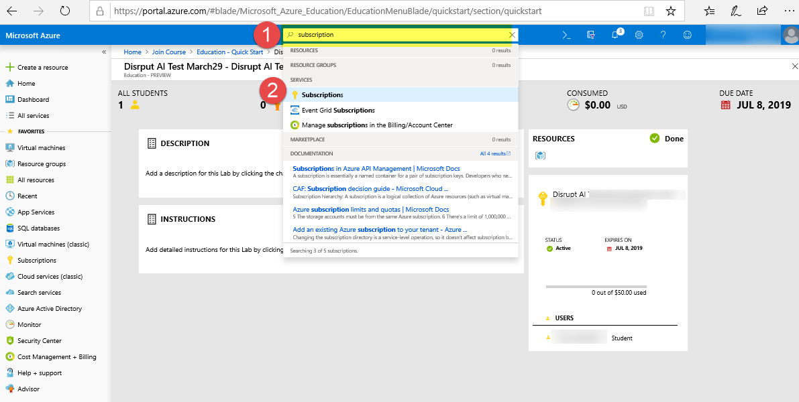

1.  De-Select “**Show only subscriptions selected in the global subscription
    filter**”

2.  Select your subscription name from the subscription list. The subscription
    name will either be *Microsoft Azure Sponsorship 2*, or will contain the
    phrase *Disrupt AI.*

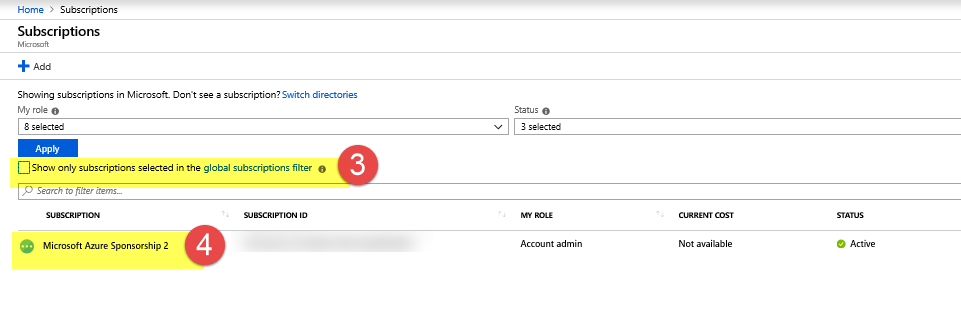

>   For each member of the team you want to provide access to the Azure
>   subscription, complete the following steps:

1.  Select **Access control (IAM)** from the menu

2.  In the “**Add a role assignment**” pane select **Add**

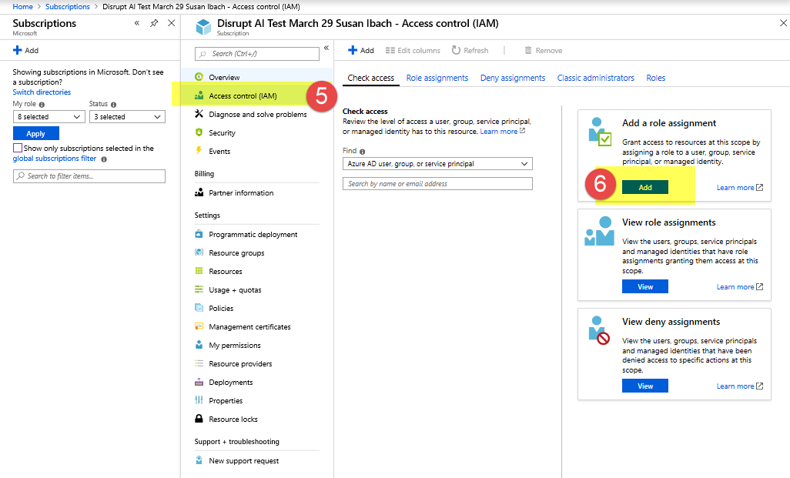

On the Add role assignment blade, enter the following values

1.  **Role**: *Owner*

2.  **Assign Access to** (leave as the default): *Azure AD user, group, or
    service principal*

3.  **Select**: Enter the Microsoft account email address for the team member
    you wish to give access to the Azure subscription

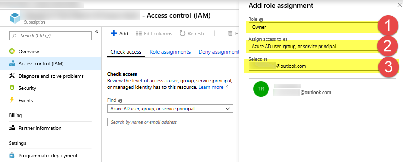

1.  Select the email address displayed in the blade, this will enable the Save
    button.

2.  Select **Save**

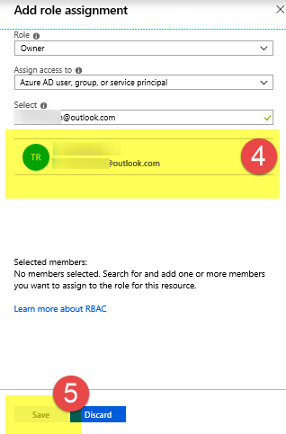

Your team member will receive an email with instructions on how to access the
subscription. If they do not see the email, check the junk/spam email folder.

If you are not sure if you completed the steps correctly, check for errors with
Azure notifications

1.  Select Notifications from the top menu

2.  Look for a notification indicating the role assignment was added
    successfully

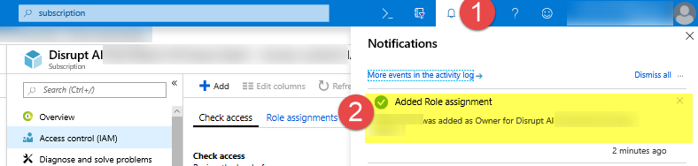

Add additional role assignments for each member of the team you wish to have
access to the team Azure subscription.
