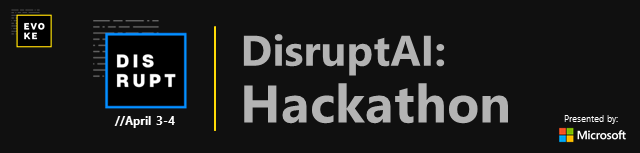

# DisruptAI

Welcome to [DisruptAI](https://www.evokecanada.com/hackathon.html).

Through this repo, we will let you know all the information that you may need to be susccessful during this hackathon. 

This repo has the following information:

1. [Disrupt-AI-Dataset-Options.md](Disrupt-AI-Dataset-Options.md) This is a list of datasets that you can use for your hackathon. This is just for reference and is not a holistic reference of datasets - please feel free to bring in your own datasets as needed. 

2. [Disrupt-AI-Azure-Subscription-Setup.md](Disrupt-AI-Azure-Subscription-Setup.md): This is a reference guide for you to activate your Azure environment

3. [Hackathon-Guide.md](Hackathon-Guide.md): This is a generic guide for you to refer on how to ideate on what you wnat to build in case you are still not sure. Once you have the idea, there is a list of technical references that you can use to build on Azure. 

4. [Technical-Reference-Guide-for-Azure.md](Technical-Reference-Guide-for-Azure.md): As the name suggests - this is a list of Azure documentation that you can use to build on Azure.

5. We also have 15 Telus IoT Devkits available for hacking if you want. Here is a link for you to refer to learn more about it and how you can use it: https://www.linkedin.com/feed/update/urn:li:activity:6516761199475068928 

If you have any questions, please do reach out to devca@microsoft.com. 
